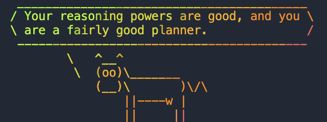

Today we started the day with an introduction to **environments**—what they are, why they matter, and how they support reproducible research. I’ve used environments before in my projects analysis, especially when training machine learning models. But this was my first time using **Pixi**, and I found it to be easy and intuitive.

I’m curious to see how I can incorporate Pixi into my workflows going forward.

---

  

---

## 🧪 What Is an Environment? What’s Pixi?

An **environment** is an isolated space where you can install software and packages without affecting your system or other projects. It helps avoid version conflicts, supports reproducibility, and makes sharing your work easier.

**Pixi** is a environment manager built for speed, simplicity, and reproducibility. It's designed to be more intuitive than tools like "conda", and so far it seems like it is.

---

## 📦🐳 Containers

We also covered **containers**, which allow you to package an entire computational environment—including software, dependencies, and OS libraries—into a portable unit.

In practice, we used **Apptainer** to run tools like **FastQC** from BioContainers without needing to install anything locally. I imagine this is useful for when you have more complex projects.

note!!
We also made a **cow** tell us our fortune. I think this is a fair description of my PhD so far:

  

---

## 📌 Final Thought
Today was definitely more challenging than yesterday. I felt tired by the end of the day, but again the bike to SLU was very pretty (I didn't get lost this time). 

My favorite exercise was the cow!