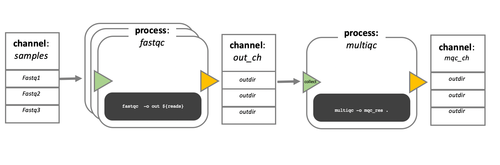

## Change of Plans !!!!

On day 4 of the Applied Bioinformatics course, we were scheduled to work hands-on with **Nextflow** pipelines. However, due to technical issues with the **HPCN cluster**, we couldn’t access the environment.

Instead, the day turned into a discussion-session focused on:

- Understanding the **structure and logic behind Nextflow pipelines**
- Reflecting on how we use **AI in bioinformatics workflows**

---

## ⚙️ What is Nextflow?

  

Nextflow is a workflow management system designed to turn computational scripts into **modular, reproducible processes** that can run independently and in parallel.

The main building blocks of a Nextflow pipeline are:

- **Processes**:  
  These are the individual tasks, which can be in any language (bash, Python, R, etc.) and runs independently.

- **Channels**:  
  These act as the **data pipes** between processes, passing files, variables, or inputs.

We spent time understanding:
- Which files are needed to run a pipeline
- How to manage environments using **Pixi**

---

## 🔁 Channels and Processes

  

One key idea is that **processes don't directly depend on each other** — they communicate through **channels**.

> You define the *what* (your process), and Nextflow handles the *when* and *how* based on available inputs.

This makes pipelines **scalable**, **portable**, and **easy to parallelize** —> especially important when working with large data on HPC clusters or cloud systems.

---

## 🧠 Reflections

Although we couldn’t run pipelines today, the discussion helped clarify some important questions I had about workflow design and reproducibility.

I also liked the conversation around how AI tools are increasingly becoming part of our daily practice as bioinformaticians. We also gave examples of how we used them.

---

## ✅ Key Takeaways

- **Nextflow = scripts + processes + channels**  
- Each process can be written in any language — it’s fully modular
- Channels are the communication system — they connect processes with data
- Workflow tools like Pixi simplify environment management for reproducibility
- Even when we can't run code, talking through design and structure is essential for deep understanding

---

📌 This day we also had the course dinner. This was a very nice oportunity to get to know everyone a bit better and enjoy a nice dinner. Thanks to Samuel and Amrei for making this happen!