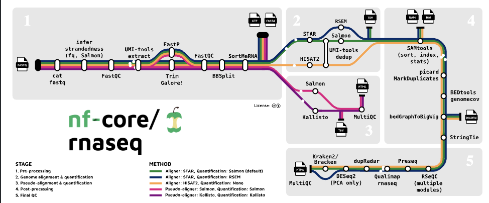

## 🧬 Exploring nf-core RNA-seq

On day four of the Applied Bioinformatics course, we worked with the "nf-core" framework to search for and run a standardized **RNA-seq pipeline**.

  

We chose the [`nf-core/rnaseq`](https://nf-co.re/rnaseq) pipeline, this is a well-documented and modular workflow built on **Nextflow** that handles everything from quality control to read alignment and quantification.

---

## ⚙️ How the Pipeline Works

Here’s an overview of the pipeline architecture:

  

Each box represents a **process** in the workflow (e.g., trimming, alignment, quantification), all managed via Nextflow. It also includes **MultiQC** for aggregating all the QC reports at the end.

---

This was a nice practice on how to use nf-core. 