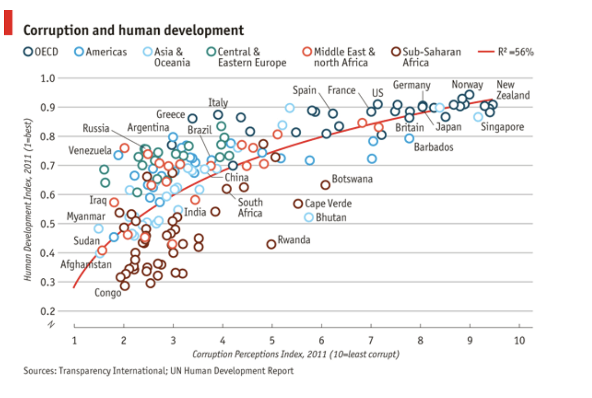
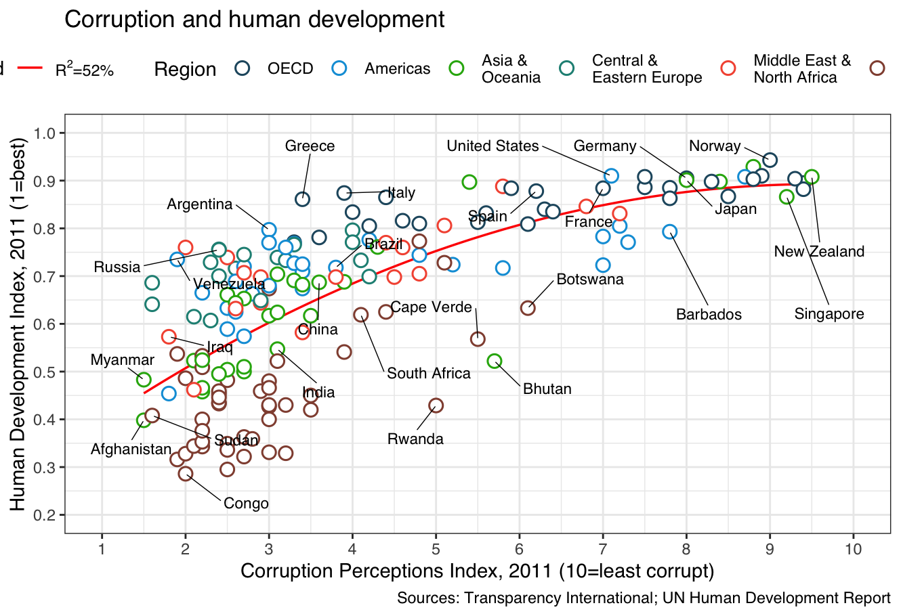

## 🧬 Learning ggplot

On day five of the **Applied Bioinformatics** course, we explored the fundamentals of **ggplot2** — one of R’s visualization libraries. We discussed principles of clarity, data storytelling, and how design choices can influence interpretation. After a short demo, we practiced building plots from scratch and then moved on to a small challenge: **recreating an existing plot.**

---

## 🎯 The Challenge

For the exercise, I chose to reproduce a plot originally published by *The Economist*.  
It was a great way to apply ggplot’s layering logic (`geom_`, `theme_`, `scale_`), while learning to match color schemes, typography, and data layout.

  

Here’s my recreated version using ggplot:

  

---

## 🧠 My own plotting experience 

I mostly work in **Python**, so using ggplot felt both familiar and new.  
In Python, I typically rely on:

- **Plotly** – for interactive visualizations  
- **Scanpy** – mainly for single-cell analysis and dimensionality reduction (but I’ve also used it for image-derived features)  
- **Matplotlib** – for fine-tuning plots and adjusting small details

What I like about ggplot is the **structured, layered grammar of graphics** — it forces you to think about how each visual element represents part of the data. It’s less “trial and error” and more **concept-driven design**.

---

## ✨ Key Takeaways

- Good plots are not just *beautiful* — they’re **informative and reproducible**.  
- Aesthetic decisions should serve the message, not distract from it.  
- Learning new plotting tools (like ggplot) expands how you think about **data communication**.  

---
